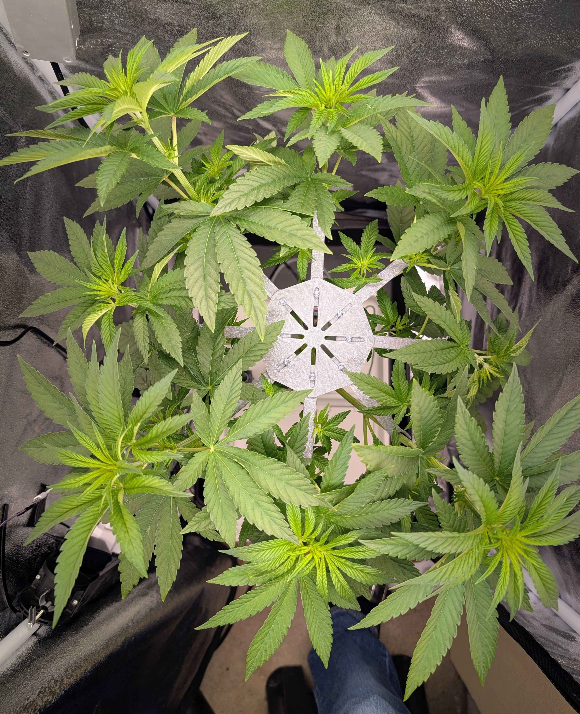

# 8x Plant Spreader

Designed this for my plant in the pringles challenge. It is intended to separate a plant with 8 arms. I was asked if I would share the model and of cause I would.  
See the two files in the "model" folder. You will need M3 screws and might need to recut the threads after printing.
The arms were designed to be modified. So you can design your own an just use the hub. It has 30mm of radial adjustment so 60mm on the diameter. Have fun ;)

 