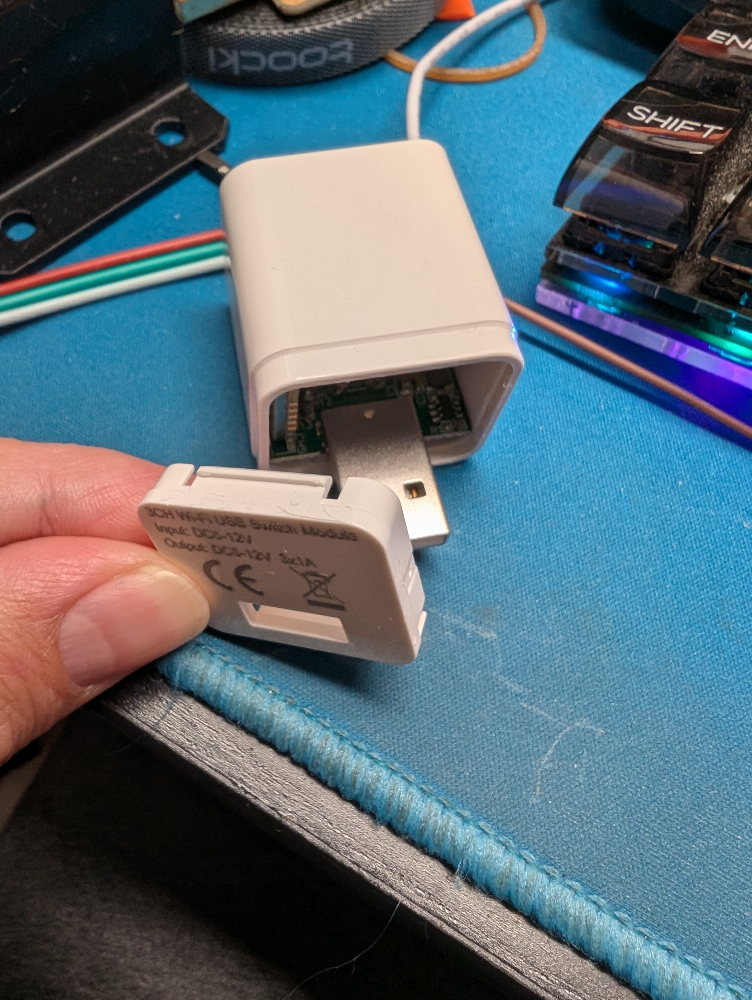
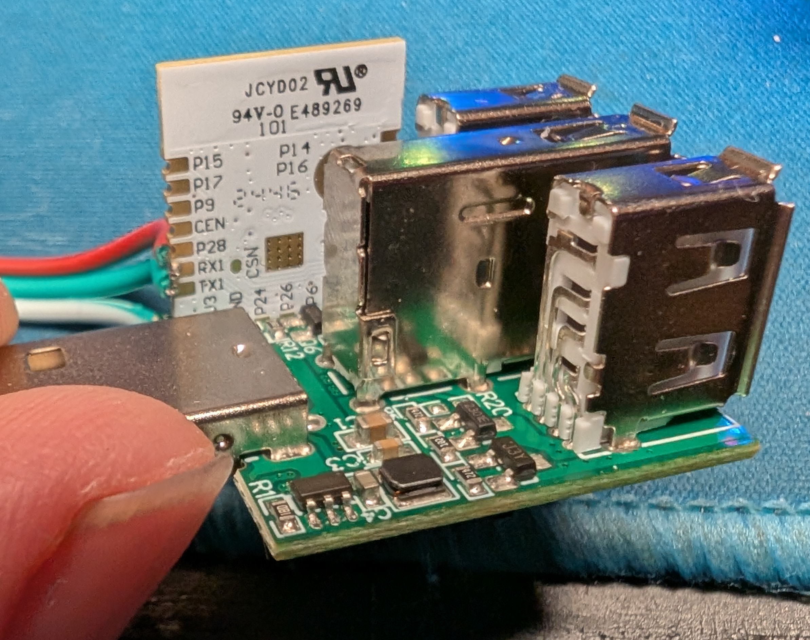
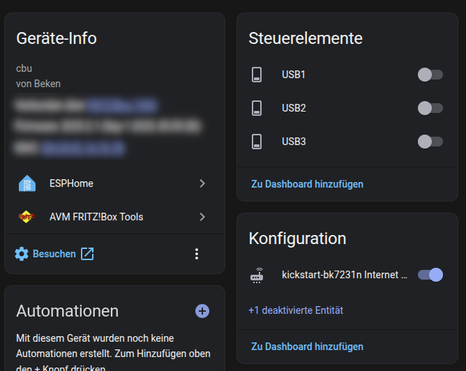

# How to flash ESPHome onto Tuya devices
Here I show my method of converting tuya wifi devices to ESPHome devices. This can be done with most tuya devices. This USB Switch is a relatively simple example but what is done here also applies for more complicated hardware.

## Needed Tools and Software:
Basic ESPHome knowlage + 
### Hardware:
- USB switch or any target Tuya device https://s.click.aliexpress.com/e/_oDWQrDL
- USB to TTL Adpater (CH340G) https://s.click.aliexpress.com/e/_ol6f1e5
### Software:
- LTChipTool https://github.com/libretiny-eu/ltchiptool
- BK7231tools https://github.com/tuya-cloudcutter/bk7231tools
- Kickstart Firmware https://github.com/libretiny-eu/esphome-kickstart/releases
## Connecting to the device
### Crack it open
       

Connect TX, RX, GND and something switchable to 3V3 or power the device on.  
Make sure to connect TX of the device to RX on the converter and RX to TX.

## Dump firmware
With converter connected, device powered OFF execute:  
`ltchiptool flash read -d /dev/ttyUSB0 BK72XX flashdump1.bin`  

Wait for tool to start and wait, then power ON the device
  

Dump it twice and use `md5sum *.bin` to compare the dumps  


## Reversing the Firmware
`bk7231tools dissect_dump -e -O dump flashdump2.bin`  

  

look into flashdump2_storage.json for hints on the used pins. In this case:
```YAML
"rl1_pin": 7,
"rl2_pin": 26,
"rl3_pin": 24,
```
## (optional) Flash Kickstart
download the proper kickstart firmware from  
https://github.com/libretiny-eu/esphome-kickstart/releases  

Device powered ON  
`ltchiptool flash write -d /dev/ttyUSB0 kickstart-bk7231n-2025-05-28.uf2`  

  

When the tool is ready shortly connect CEN to GND and the upload will start  
After flashing it will set a hotspot and be reachable via http://kickstart-bk7231n.local/  
Now you can connect it to your wifi and still reach it under the same address  
Helpful for further reversing, testing and uploading  


## flashing ESPHome
Generate a config in HomeAssistant choosing
```YAML
bk72xx:
board: cbu
```
Most settings can be left unchanged, but we need to add the pins
```YAML
switch:
- platform: gpio
  name: "USB1"
  pin: GPIO7
- platform: gpio
  name: "USB2"
  pin: GPIO26
- platform: gpio
  name: "USB3"
  pin: GPIO24
```
Flash via ESPHome integration in HomeAssistant or locally  
`esphome compile 3xusbswitch.yaml`  
`esphome upload --device 3xusbswitch.local 3xusbswitch.yaml`

## Done!
Just add it inside your ESPHome devices and done


